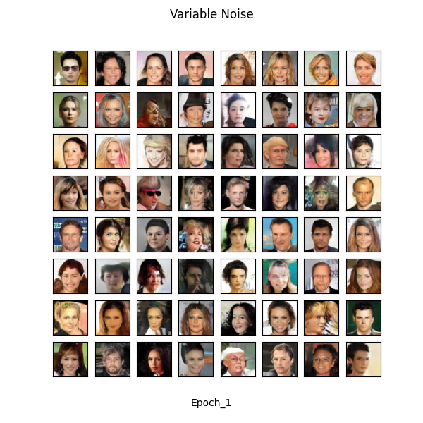

# Fake-Face-Generation

This is the pytorch implementation of 3 different GAN models using same convolutional architecture.

 - DCGAN (Deep convolutional GAN)
 - WGAN-CP (Wasserstein GAN using weight clipping)
 - WGAN-GP (Wasserstein GAN using gradient penalty)

## Dependencies

- Python 3.x
- PyTorch
- torchvision
- numpy
- matplotlib
- tqdm

## Usage

1. Clone the repository:

```bash
git clone https://github.com/sherlockholmes1603/Fake-Face-Generation.git
```

2. Install dependencies:

```bash
pip install -r requirements.txt
```

3. Train the GAN models:

```bash
python3 main.py --model DCGAN/WGAN-CP/WGAN-GP --is-train --dataroot "/kaggle/input/celeba-dataset/img_align_celeba/" --epochs 10 --cuda --load_G models/wgan_cp/generator_epoch5.pth --load_D models/wgan_cp/critic_epoch5.pth 
```

4. Generate fake faces:


```bash
python3 main.py --model DCGAN/WGAN-CP/WGAN-GP  --load_G models/wgan_cp/generator_epoch5.pth --load_D models/wgan_cp/critic_epoch5.pth 
```

Note:

Replace DCGAN, WGAN-CP, or WGAN-GP with the desired model.
--dataroot should point to the CelebA dataset.
--epochs is the number of training epochs.
--load_G and --load_D are the paths to the pre-trained generator and discriminator models, respectively.
Once the training is complete, the generated fake faces will be saved in the results directory.

## Fake images generated by the models are

1. DCGAN



2. WGAN with weight clipping


- The implementation is inspired by the original papers on DCGAN, WGAN-CP, and WGAN-GP.
- Dataset used for training: [link to dataset]
